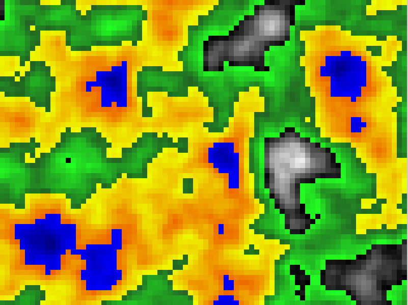

# Random Terrain Generation

## Description
This project generates a simple 2D terrain using Perlin noise. It serves as an introduction to procedural generation.

## Technologies Used
- **C++**
- **SFML**

## How to Run
1. **Instructions to run the project.**
   - For example: Compile the code with the appropriate compiler or open the project in the specified engine.

## Challenges and Learnings
- Experimented with Perlin noise to create natural-looking terrain.
- Learned about noise functions and their applications in game development.

## Examples and Screenshots

### Perlin Noise

There are many ways to generate random terrain. One of the most popular methods is to use Perlin noise. Perlin noise is a type of gradient noise developed by Ken Perlin in 1983. It is widely used in computer graphics for applications such as procedural texture generation, terrain generation, and more.

## Future Work

- Add more features to the terrain generation algorithm.
- Implement a more complex noise function for better results.

## Resources

- [Perlin Noise](https://en.wikipedia.org/wiki/Perlin_noise)

